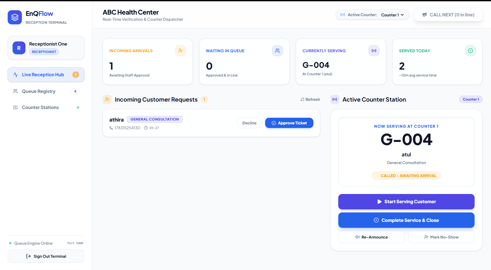
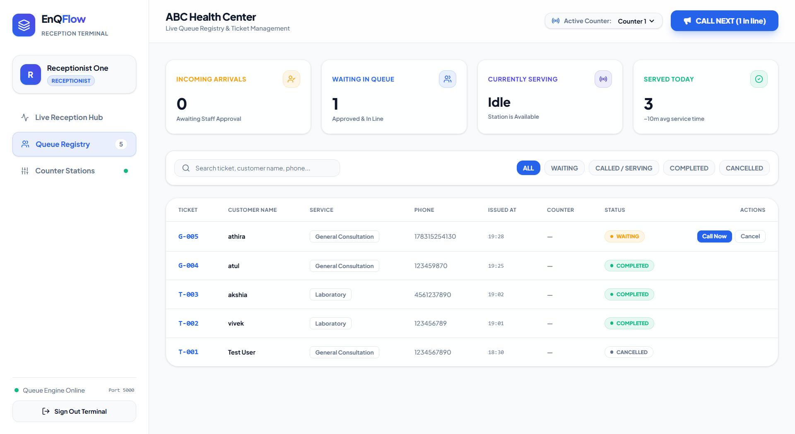
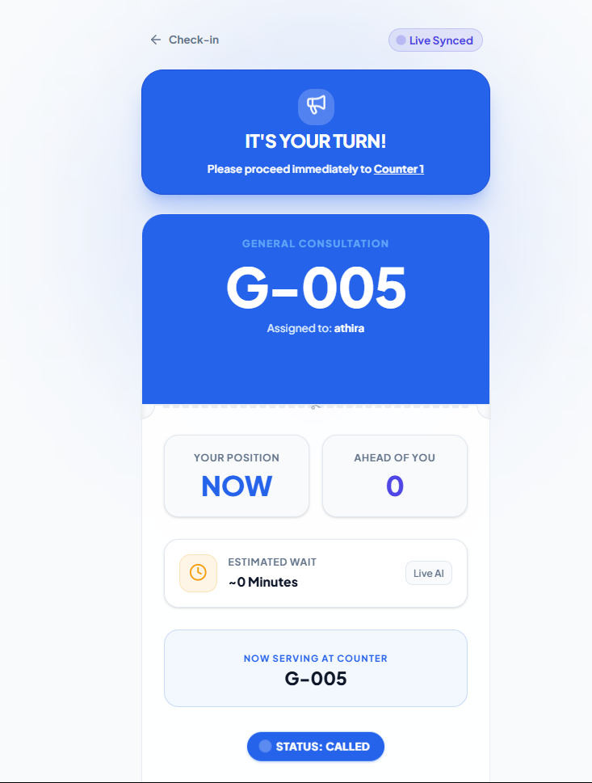

# EnQFlow

**EnQ** → Enqueue → Join  
**Flow** → Move smoothly through the queue

## Overview
EnQFlow is a **real-time digital queue management system** designed for clinics, hospitals, salons, government offices, and small businesses. It eliminates the need for physical waiting lines, allowing customers to join a queue digitally and monitor their status in real time.

## Problem
Traditional queuing requires customers to sit in a physical waiting area, causing congestion, frustration, and a poor customer experience. Mobile applications for queue management often force users to download an app they might only use once. Furthermore, fully digital open queues can be abused by individuals joining remotely without being physically present.

## Solution
EnQFlow provides a hybrid solution:
1. **Physical Presence Verification**: Customers scan a permanent QR code at the reception. This sends a "Queue Request" to the receptionist. The customer is only added to the queue when the receptionist physically verifies their presence and clicks "Approve".
2. **No App Installation Required**: The customer tracks their queue status via a lightweight, mobile-first Progressive Web App (PWA) accessed directly through their browser.
3. **Real-time Synchronization**: A dedicated Electron desktop app for receptionists syncs instantly with the customer's web interface and a public display screen.

## Features
*   **Customer Web App (PWA)**: Mobile-first interface for joining queues, viewing live positions, and receiving browser push notifications.
*   **Digital Perforated Pass**: Animated digital ticket with realistic paper-tear physics when completed.
*   **Receptionist Desktop App**: Powerful Electron-based dashboard for approving requests, calling customers, and managing counters.
*   **Live Queue Registry & Hub**: Multi-tab dashboard showing real-time clinical metrics, incoming arrivals, and instant counter station management.
*   **Real-time Engine**: Powered by Socket.IO, ensuring sub-second updates across all connected clients.
*   **Public Display Mode**: A specialized TV/Monitor interface (`/display`) for showing currently called tickets.
*   **Safe SQLite Backups**: Built-in mechanisms to safely backup the database even while writes are occurring.

## Visual Tour

Here is a visual walkthrough of the EnQFlow system and its different real-time states:

### 1. Live Reception Hub (Desktop App)

**What it does:** The primary interface for receptionists to manage the daily queue. It displays real-time clinical metrics (arrivals, waiting count, served today) and allows the receptionist to approve incoming customer requests directly into the line. It also includes an active counter station module to immediately call the next customer with a single click.

### 2. Queue Registry (Desktop App)

**What it does:** A comprehensive, searchable database of all tickets for the day. Receptionists can monitor the status of every customer (WAITING, CALLED, COMPLETED, CANCELLED) and take direct actions such as calling a specific customer out of turn or canceling a ticket.

### 3. Customer Digital Pass - "Called" State (Web App)
<div align="center">
  
</div>
**What it does:** When a receptionist calls the customer's ticket, the mobile web pass instantly updates with a prominent "IT'S YOUR TURN!" notification banner and plays an audio chime. The status pill pulses to guide the customer to their designated counter immediately.

### 4. Customer Digital Pass - "Completed" Tear (Web App)
<div align="center">
  
</div>
**What it does:** Once the service is finished and the receptionist closes the ticket, the digital web pass simulates a physical paper tear. Using CSS animations, the ticket splits in half along the jagged perforation line, and a red "SERVED" watermark stamp slams onto the top stub, providing a satisfying, tactile conclusion to the customer's journey.

## Architecture

The system consists of two separate client applications communicating with a central Node.js backend.

```text
                    EnQFlow
                       │
           ┌───────────┴───────────┐
           │                       │
           ▼                       ▼
   EnQFlow Desktop          EnQFlow Web/PWA
   Electron + React         React + Vite
   Receptionist             Customer
           │                       │
           └───────────┬───────────┘
                       │
                REST API + Socket.IO
                       │
                       ▼
                Node.js + Express
                       │
                       ▼
                    SQLite (better-sqlite3)
```

## Queue State Machine

The backend enforces a strict state machine to prevent client-side manipulation.

1.  **REQUESTED**: Customer submits details via the web app.
2.  **APPROVED** / **DECLINED**: Receptionist physically verifies the customer. If approved, a Ticket is generated.
3.  **WAITING**: Customer is in the queue.
4.  **CALLED**: Customer's turn has arrived; they are assigned a counter.
5.  **SERVING**: Customer is actively being served.
6.  **COMPLETED**: Service finished.
7.  **NO_SHOW** / **CANCELLED**: Alternative termination states.

## Technology Stack

| Component | Technology |
| :--- | :--- |
| **Desktop App** | Electron, React, TypeScript, Vite, Tailwind CSS, Zustand |
| **Web App** | React, TypeScript, Vite, Tailwind CSS, PWA |
| **Backend** | Node.js, Express.js, TypeScript, Socket.IO |
| **Database** | SQLite (`better-sqlite3`) |
| **Validation & Auth** | Zod, bcrypt, JWT |

## Installation & Running the Application

### 1. Prerequisites
*   Node.js (v18+)
*   npm

### 2. Install Dependencies
Install dependencies for the root runner and all sub-projects:

```bash
npm install
cd server && npm install
cd ../web && npm install
cd ../desktop && npm install
```

### 3. Environment Variables
Copy the `.env.example` file to `.env` in the root directory and configure it.

### 4. Run the Application
The entire application stack (Backend, Web App, Desktop App) can now be started concurrently with a single command from the root directory:

```bash
npm run dev
```
*(On the first run, the database schema will be automatically created and seeded).*

*   **Customer Web App:** Access at `http://localhost:5173`
*   **Receptionist Desktop App:** Electron will launch automatically.
*   **Backend Server:** Runs silently on port 5000.

## Manual Configuration Required

The following environment variables must be configured in your `.env` file before full production use:

| Variable | Purpose | Required? |
| :--- | :--- | :--- |
| `JWT_SECRET` | Used for signing authentication tokens. | **Yes** |
| `VAPID_PUBLIC_KEY` | Public key for Web Push Notifications. | Optional (for Push) |
| `VAPID_PRIVATE_KEY` | Private key for Web Push Notifications. | Optional (for Push) |
| `ONEDRIVE_CLIENT_ID` | Microsoft Entra ID Client ID for cloud backup. | Optional |
| `ONEDRIVE_CLIENT_SECRET` | Microsoft Entra ID Client Secret. | Optional |
| `FRONTEND_URL` | Used for CORS policies on the backend. | **Yes** (in production) |

---
*Developed as a comprehensive portfolio project demonstrating real-time systems, desktop development, and practical software architecture.*